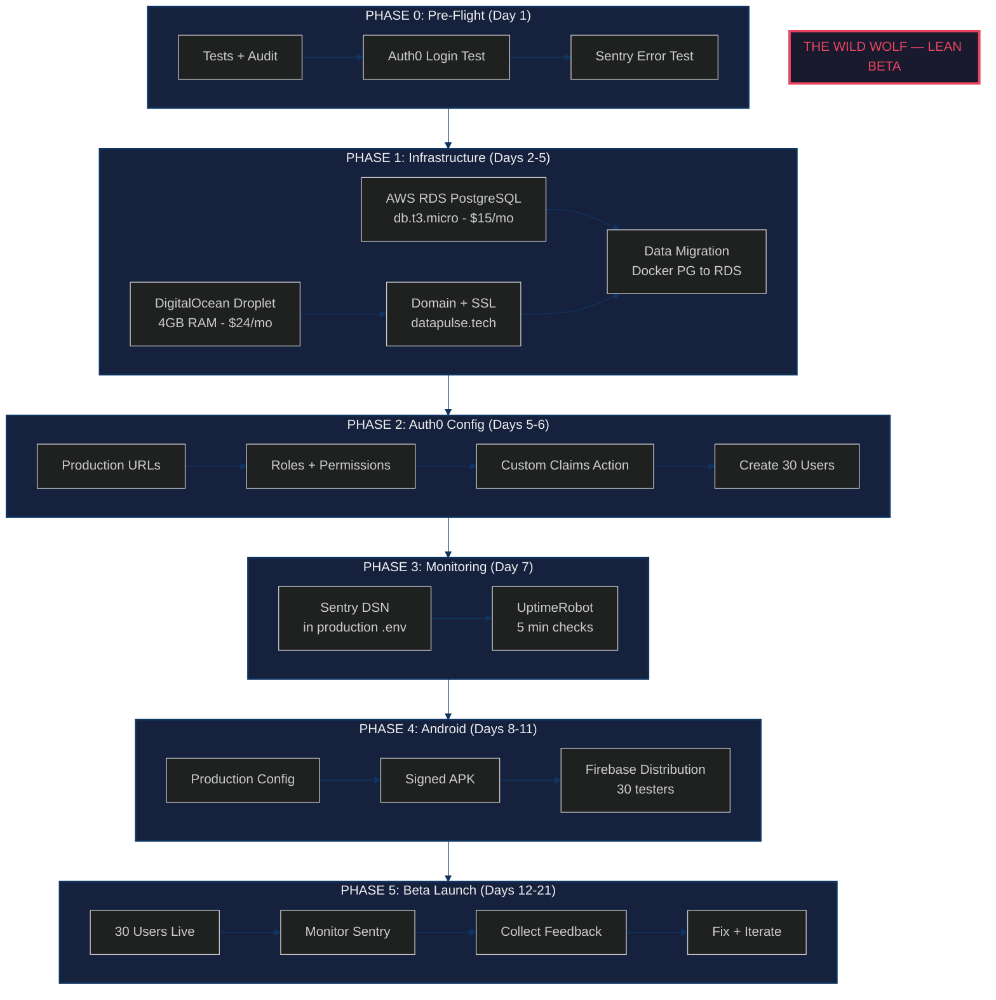
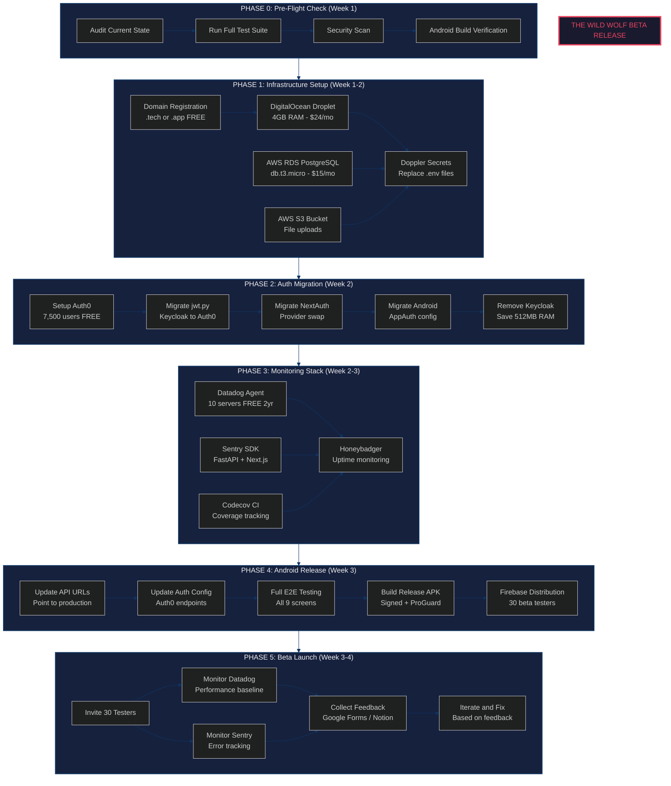

# Wild Wolf Beta Release (COMPLETED)

> **Project**: DataPulse — Business/Sales Analytics SaaS
> **Codename**: The Wild Wolf
> **Target**: Beta release for 30 testers
> **Final Timeline**: 3 weeks (v2 Lean Edition)
> **Budget**: $0 (DigitalOcean $200 + AWS $200 credits)

---

## Overview

Wild Wolf was the beta release plan for DataPulse, targeting 30 external testers across web (Next.js) and Android (Kotlin/Compose). The plan went through two iterations — a comprehensive v1 and a streamlined Lean v2 — before execution.

### Executive Summary

| Item | Detail |
|------|--------|
| **Goal** | Launch DataPulse beta (web + Android) for 30 users |
| **Budget** | $0 — DigitalOcean $200 + AWS $200 credits |
| **Timeline** | 3 weeks (5 phases) |
| **Platforms** | Web (Next.js) + Android (Kotlin/Compose) |
| **Auth** | Auth0 (replaced Keycloak, saved 512MB RAM) |
| **Hosting** | DigitalOcean Droplet + AWS RDS/S3 |
| **Monitoring** | Sentry + UptimeRobot |
| **CI/CD** | GitHub Actions |

---

## Current State Assessment

### Backend (FastAPI)

| Metric | Status | Notes |
|--------|--------|-------|
| API Endpoints | 14+ | Analytics (10) + Pipeline (4) |
| Test Coverage | 95%+ | pytest + pytest-cov |
| Security | Done | RLS, JWT, rate limiting, CORS |
| Authentication | Done | Migrated to Auth0 |
| Async Tasks | Done | Celery + Redis |
| Data Pipeline | Done | Bronze -> Silver -> Gold |
| dbt Models | Done | 6 dims + 1 fact + 8 aggs |

### Frontend (Next.js 14)

| Metric | Status | Notes |
|--------|--------|-------|
| Pages | 6 | Dashboard, Products, Customers, Staff, Sites, Returns |
| E2E Tests | 18+ specs | Playwright (Chromium) |
| Theme | Done | Dark/Light mode |
| Auth | Done | NextAuth with Auth0 provider |
| Mobile | Done | Touch swipe, responsive |
| Print Report | Done | /dashboard/report |

### Android App (Kotlin + Compose)

| Metric | Status | Notes |
|--------|--------|-------|
| Screens | 9 | Login, Dashboard, Products, Customers, Staff, Sites, Returns, Pipeline, Settings |
| Architecture | Done | Clean Architecture + MVVM |
| Auth | Done | AppAuth + Auth0 |
| Caching | Done | Room DB + cache-first strategy |
| State | Done | StateFlow + Resource pattern |
| Charts | Done | Vico Charts 2.0 |

### Infrastructure (Production)

| Service | RAM | Notes |
|---------|-----|-------|
| FastAPI (4 workers) | 512MB | API server |
| Next.js (SSR) | 512MB | Frontend |
| n8n | 512MB | Workflow automation |
| Celery Worker | 512MB | Async tasks |
| Redis 7 | 64MB | Cache + broker |
| Traefik | 64MB | Reverse proxy + SSL |
| pgAdmin | 256MB | DB admin (optional) |
| **Total** | **~2.4GB** | 1.6GB free buffer on 4GB Droplet |

Note: PostgreSQL moved to AWS RDS. Keycloak removed (replaced by Auth0). Jupyter/Lightdash removed (not needed in production).

---

## Tool Selection (v2 Lean)

The plan was revised from 14 tools down to 6, reducing setup complexity without increasing cost.

### v1 vs v2 Comparison

| v1 (Original) | v2 (Lean) | Reason |
|---------------|-----------|--------|
| 14 external tools | 6 tools | Most were overkill for 30 users |
| Datadog | docker stats | 30 users do not need APM |
| Doppler | .env on server | Same result, zero setup |
| Codecov | Skipped | Coverage is 95%, already known |
| Honeybadger | UptimeRobot | Free forever, equivalent function |
| Stripe | Skipped | No billing in beta |
| Lightdash | Skipped | Next.js dashboard already exists |
| 4 weeks | 3 weeks | Fewer tools, less setup time |

### Tools Used

| Tool | Role | Cost |
|------|------|------|
| **Auth0** | Authentication (replaced Keycloak) | Free (7,500 users) |
| **Sentry** | Error tracking (FastAPI + Next.js) | Free tier (5K errors/mo) |
| **UptimeRobot** | Uptime monitoring | Free (50 monitors) |
| **DigitalOcean** | Hosting (Droplet) | $24/mo from $200 credit |
| **AWS RDS** | Database (PostgreSQL 16) | ~$15/mo from $200 credit |
| **GitHub Actions** | CI/CD | Free |

---

## Phase Breakdown

### PHASE 0: Pre-Flight (Day 1)

**Goal**: Verify everything works before touching infrastructure.

| # | Task | Time |
|---|------|------|
| 0.1 | Run pytest — all tests pass (95%+) | 15min |
| 0.2 | Run Playwright E2E — 18 specs pass | 15min |
| 0.3 | docker compose up --build — all services healthy | 10min |
| 0.4 | Test Auth0 login flow (localhost) | 10min |
| 0.5 | Test Sentry error capture (trigger test error) | 5min |
| 0.6 | pip-audit + npm audit — no critical vulns | 10min |
| 0.7 | Build Android debug APK | 30min |

**Exit Criteria**:
- All tests green
- Auth0 login works on localhost
- Sentry receives test error
- No critical security vulnerabilities
- Android APK builds

---

### PHASE 1: Infrastructure (Days 2-5)

**Goal**: Production server running with HTTPS.

#### DigitalOcean Droplet

| Setting | Value |
|---------|-------|
| Size | s-2vcpu-4gb ($24/mo) |
| Region | Frankfurt (FRA1) |
| OS | Ubuntu 24.04 LTS |
| Backups | Yes ($4.80/mo) |

#### AWS RDS PostgreSQL

| Setting | Value |
|---------|-------|
| Engine | PostgreSQL 16.x |
| Instance | db.t3.micro (Free Tier eligible) |
| Storage | 20GB gp3 |
| Region | eu-central-1 (same as Droplet) |
| Backup | Automated daily, 7-day retention |

#### Domain + SSL

```
DNS Records:
  A     datapulse.tech      -> Droplet IP
  CNAME www                 -> datapulse.tech
  CNAME api                 -> datapulse.tech

Traefik Routing:
  datapulse.tech         -> Next.js :3000
  datapulse.tech/api/*   -> FastAPI :8000
  datapulse.tech/health  -> FastAPI :8000
```

Let's Encrypt auto-SSL via Traefik.

#### Secrets Management

`.env` file on the Droplet at `/opt/datapulse/.env`, permissions `600`, owned by deploy user.

**Exit Criteria**:
- Droplet running with Docker
- RDS PostgreSQL accessible from Droplet
- S3 bucket created
- Data migrated to RDS
- datapulse.tech resolving with HTTPS
- All services healthy on production

---

### PHASE 2: Auth0 Configuration (Days 5-6)

**Goal**: Auth0 fully configured for production. Code migration was completed prior to this phase.

#### Application Settings

```
Application: DataPulse (Regular Web App)
Domain:      datapulse.eu.auth0.com

Callback URLs:
  http://localhost:3000/api/auth/callback/auth0    (dev)
  https://datapulse.tech/api/auth/callback/auth0   (prod)
```

#### API Resource

```
Name:       DataPulse API
Identifier: https://api.datapulse.tech   (AUTH0_AUDIENCE)
Signing:    RS256
RBAC:       Enabled
```

#### Roles and Permissions

```
admin:   read:analytics, write:pipeline, manage:users
viewer:  read:analytics
```

#### Custom Claims Action (Post Login)

```javascript
exports.onExecutePostLogin = async (event, api) => {
  const namespace = 'https://datapulse.tech';
  api.accessToken.setCustomClaim(`${namespace}/tenant_id`, 1);
  const roles = event.authorization?.roles || [];
  api.accessToken.setCustomClaim(`${namespace}/roles`, roles);
};
```

#### Android Native App

```
Type:                  Native (PKCE only, no client_secret)
Allowed Callback URLs: com.datapulse.android:/oauth2callback
Allowed Logout URLs:   com.datapulse.android:/oauth2callback
```

**Exit Criteria**:
- Production callback URLs configured
- API resource created (audience)
- Roles (admin/viewer) created
- Custom claims Action deployed
- Beta users created (invite-only, no self-signup)
- Android native app configured
- Login works on https://datapulse.tech
- Login works on Android with production API

---

### PHASE 3: Monitoring Setup (Day 7)

**Goal**: Know when things break before users report them.

#### Sentry

SDK integrated in both FastAPI (`sentry-sdk[fastapi]`) and Next.js (`@sentry/nextjs`). Captures unhandled exceptions, ErrorBoundary events, and tags by environment.

Alert rules:
- New issue -> Email notification
- Issue frequency > 10/hour -> Urgent email

#### UptimeRobot

```
Monitor type:  HTTPS
URL:           https://datapulse.tech/health
Interval:      5 minutes
Alert:         Email
```

**Exit Criteria**:
- Sentry DSN in production .env
- Sentry receives test error from production
- UptimeRobot monitoring https://datapulse.tech/health
- Email alerts working

---

### PHASE 4: Android Release (Days 8-11)

**Goal**: APK in testers' hands.

#### Production Config

```kotlin
// build.gradle.kts — release buildType
release {
    buildConfigField("String", "API_BASE_URL",
        "\"https://datapulse.tech\"")
    buildConfigField("String", "AUTH0_DOMAIN",
        "\"datapulse.eu.auth0.com\"")
    buildConfigField("String", "AUTH0_CLIENT_ID",
        "\"<native-app-client-id>\"")
    isMinifyEnabled = true
    proguardFiles(...)
    signingConfig = signingConfigs.getByName("release")
}
```

#### Release Checklist

| # | Task |
|---|------|
| 4.1 | Update build.gradle.kts with production URLs |
| 4.2 | Create release keystore |
| 4.3 | Build signed APK |
| 4.4 | Test all 9 screens with production API |
| 4.5 | Fix any issues |
| 4.6 | Upload to Firebase App Distribution |
| 4.7 | Invite 30 testers |

**Exit Criteria**:
- Signed APK built with production config
- All 9 screens work with production API
- Auth0 login works on Android
- APK uploaded to Firebase
- 30 testers invited

---

### PHASE 5: Beta Launch (Days 12-21)

**Goal**: 30 users testing, feedback flowing, bugs squashed.

#### Launch Day Checklist

```
[ ] https://datapulse.tech loads with HTTPS
[ ] Auth0 login works (web)
[ ] Auth0 login works (Android)
[ ] All 6 dashboard pages render data
[ ] Pipeline trigger works
[ ] Sentry is capturing (test error)
[ ] UptimeRobot is monitoring
[ ] 30 Auth0 accounts created
[ ] Firebase APK distributed
[ ] Feedback form ready (Google Forms)
[ ] Backup verified (RDS automated)
```

#### Daily Routine

```
Morning:
  - Check UptimeRobot — any downtime?
  - Check Sentry — new errors?
  - Check feedback form — new responses?
  - Fix anything critical

Weekly:
  - SSH to Droplet: docker stats (check RAM/CPU)
  - Review Sentry error trends
  - Compile feedback summary
  - Deploy fixes: git pull && docker compose up -d --build
```

#### Deploy Process

```bash
ssh deploy@datapulse.tech
cd /opt/datapulse
git pull origin main
docker compose -f docker-compose.yml -f docker-compose.prod.yml up -d --build
docker compose ps
curl https://datapulse.tech/health
```

#### Success Metrics

| Metric | Target | How to Check |
|--------|--------|-------------|
| Uptime | > 99% | UptimeRobot dashboard |
| API p95 latency | < 500ms | Sentry performance tab |
| Error rate | < 1% | Sentry issues |
| Active users | 20+ of 30 | Auth0 dashboard |
| Crash-free (Android) | > 99% | Firebase Crashlytics |
| Feedback responses | 15+ | Google Forms |
| Critical bugs | 0 open | Sentry |

#### Feedback Form Questions

1. How easy was it to log in? (1-5)
2. Which pages did you use? (checkboxes)
3. How useful is the dashboard? (1-5)
4. Did you encounter any errors? (text)
5. What feature would you add? (text)
6. Would you use this daily? (yes/no/maybe)
7. Overall rating (1-10)

---

## Budget

### Monthly Cost

| Service | Cost | Source |
|---------|------|--------|
| Droplet (4GB) | $24.00 | DO credit |
| Backups | $4.80 | DO credit |
| RDS (db.t3.micro) | ~$15.00 | AWS credit |
| S3 | ~$0.50 | AWS credit |
| Auth0 | $0 | Free tier |
| Sentry | $0 | Free tier |
| UptimeRobot | $0 | Free tier |
| GitHub Actions | $0 | Free tier |
| Firebase | $0 | Free tier |
| **Total** | **~$44/mo** | **From credits = $0** |

### Runway

```
DigitalOcean: $200 / $29/mo = ~7 months
AWS:          $200 / $16/mo = ~12 months
Effective:    ~8 months at $0 out of pocket
After credits expire: ~$44/month
```

---

## Risk Matrix

| Risk | Impact | Probability | Mitigation |
|------|--------|-------------|------------|
| Auth0 flow breaks in prod | HIGH | LOW | Already tested on localhost |
| Droplet runs out of RAM | MEDIUM | LOW | 1.6GB free buffer, no Keycloak/Jupyter |
| RDS connection slow | MEDIUM | LOW | Same region (eu-central-1 / FRA1) |
| Data loss during migration | HIGH | LOW | pg_dump backup before migration |
| 30 users find critical bug | MEDIUM | MEDIUM | Sentry alerts -> fix in < 24h |
| SSL certificate issues | MEDIUM | LOW | Traefik + Let's Encrypt = auto |
| Credits expire mid-beta | LOW | LOW | 8 month runway > 3 week beta |
| Android crashes on some devices | MEDIUM | MEDIUM | Firebase Crashlytics |

---

## Timeline

```
Week 1              Week 2              Week 3
────────────────    ────────────────    ────────────────
Day 1               Days 5-6            Days 12-21
PHASE 0             PHASE 2             PHASE 5
Pre-flight          Auth0 config        BETA LAUNCH
Tests + audit       Dashboard setup     30 users
                    Roles + users       Monitor
Days 2-5                                Feedback
PHASE 1             Day 7               Iterate
DigitalOcean        PHASE 3             Fix bugs
AWS RDS             Sentry setup
Domain + SSL        UptimeRobot
Data migration
                    Days 8-11
                    PHASE 4
                    Android APK
                    Firebase dist
```

---

## Go/No-Go Checklist

| # | Check | Required |
|---|-------|----------|
| 1 | pytest passes (95%+) | MUST |
| 2 | Playwright E2E passes | MUST |
| 3 | Auth0 login works (web) | MUST |
| 4 | Auth0 login works (Android) | MUST |
| 5 | https://datapulse.tech loads | MUST |
| 6 | API responds < 500ms | MUST |
| 7 | SSL certificate valid | MUST |
| 8 | Sentry receiving errors | MUST |
| 9 | UptimeRobot monitoring | MUST |
| 10 | RDS backups enabled | MUST |
| 11 | 30 user accounts created | MUST |
| 12 | Android APK on Firebase | MUST |
| 13 | Feedback form ready | MUST |
| 14 | GitHub Actions CI green | NICE |

---

## Tools to Add Later (When Needed)

| Tool | When to Add | Trigger |
|------|-------------|---------|
| Datadog | > 100 users | Need APM, not just error tracking |
| Doppler | Multi-env deploys | When staging environment is needed |
| Codecov | PR-heavy phase | When multiple contributors join |
| Stripe | Revenue phase | When billing is implemented |
| Cloudflare | High traffic | When CDN/DDoS protection needed |
| GitHub Actions CD | Frequent deploys | When manual SSH deploy is annoying |

---

## Architecture Diagrams

### Lean Architecture (v2)



---

### Full Architecture (v1)



---

*Plan originally generated: 2026-04-01 | Revised to Lean v2: 2026-04-01*
*Completed: 2026-04-05*
